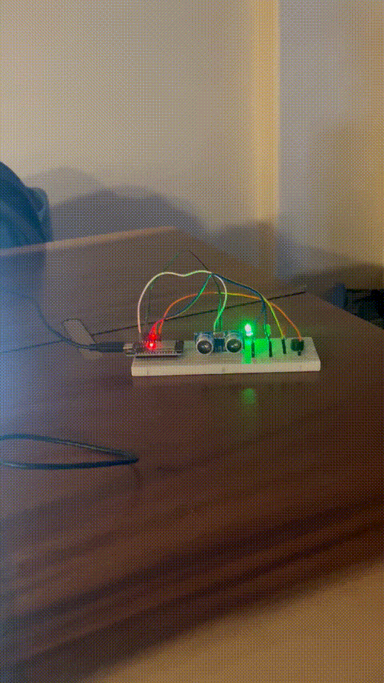

# Swipper
This project utilizes arduino ultrasonic sensors, leds and a small speaker to try and disuade my cat from chewing on the flowers I got my wife.
Considering adding alerts which could notify me when he's up to no good haha but mainly used as a project to explore what it looks like to program
an esp32.

## Setup
* Check the secrets.example.h
* Make a copy as `secrets.h` and add values for you wifi AP

## Building & Flashing
### Pull in IDF environment and setup esp32 usb serial device
* source $IDF_PATH/export.sh
* ESP32_SER=/dev/<esp32-usb-serial-device> (e.g. - ttyUSB0, ttyUSB1)
## Configure (Optional)
* idf.py menuconfig
## Build
* idf.py build
## Flash
* idf.py -p $ESP32_SER flash
## Monitor
* idf.py -p $ESP32_SER monitor
## All
* idf.py -p $ESP32_SER flash monitor

## Demo

## Schematics
coming soon...

